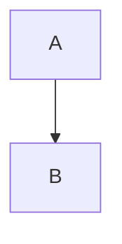

# MermaidJS.Blazor

A simple MermaidDiagram component for Blazor.

For more information on MermaidJS including the diagram definition syntax, JavaScript API, or other supported features, please visit: https://mermaid-js.github.io/.

## Getting Started

### 1. Install the `MermaidJS.Blazor` NuGet package.

```bash
> dotnet add package MermaidJS.Blazor
```

### 2. Add `builder.Services.AddMermaidJS()` to your `Program.cs`.

```csharp
using Microsoft.Extensions.DependencyInjection;

// ... //

builder.Services.AddMermaidJS();
```
> NOTE: You do not need to include mermaid.js or mermaid.min.js in your index.html. MermaidJS.Blazor will load the library on demand at runtime.

### 3. Use the `MermaidDiagram` component in your app.

```html
@using MermaidJS.Blazor

<!-- ... -->

<MermaidDiagram Definition="@diagramDefinition" OnClick="OnClickNode" />

@code
{
    string diagramDefinition = "graph TB\nA-->B";

    void OnClickNode(string nodeId)
    {
        // TODO: do something with nodeId
    }
}
```

## Handling Node Clicks

To raise node click events back to your blazor component, set your click callback to `onClickMermaidNode`:


